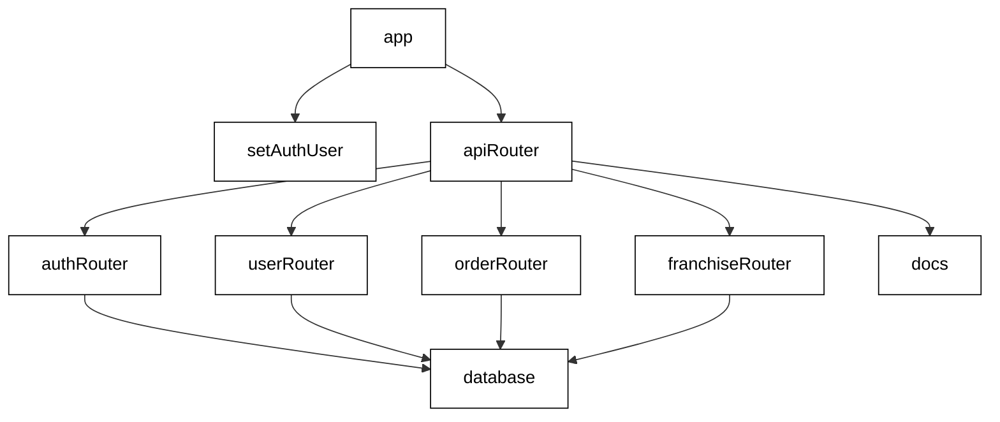
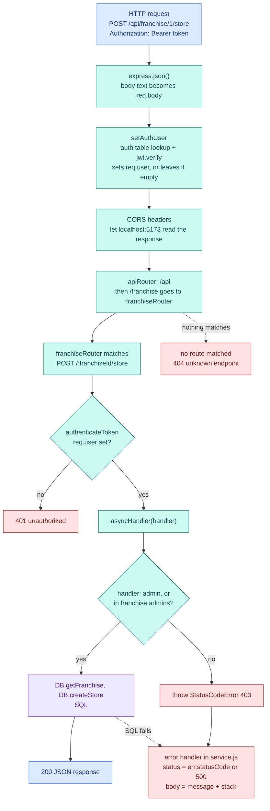

# JWT Pizza Service docs

The backend REST API for JWT Pizza: Node + Express + MySQL. It stores users, franchises, stores, the menu, and
orders, and it asks the JWT Pizza Factory to make each pizza.

- **This page:** what every file does, how the app is wired together, and what happens to one request.
- **[database.md](database.md):** the tables, how they connect, and which code touches them.
- **The frontend repo, jwt-pizza, `docs/`:** the whole-system map and each user activity drawn out click → endpoint → SQL.

The code is annotated too. Every file opens with a `@fileoverview` summary, and every route handler and database
method has a `/** ... */` comment listing its endpoint, permissions, and SQL. Hover a function name in VS Code to
read it.

## Every file in one line

```text
jwt-pizza-service/
├── package.json              Dependencies (express, mysql2, bcrypt, jsonwebtoken) and `npm start`.
├── package-lock.json         Exact dependency versions (generated; don't edit).
├── .gitignore                Files git ignores. Includes src/config.js, so secrets never get committed.
├── deployService.sh          Old manual deploy: copy to a server over ssh and restart with pm2.
├── README.md, LICENSE        Course readme and license.
├── CLAUDE.md                 Project context for AI-assisted work.
├── docs/                     These docs.
├── scripts/
│   ├── dev.sh                Runs backend then frontend together; --reset rebuilds and seeds the database.
│   ├── generatePizzaData.sh  Seeds test data (menu, franchisee, franchise, stores) using curl.
│   └── notes.md              Explanations of the scripts' trickier lines.
└── src/
    ├── index.js              Entry point: starts the app on port 3000 (or the first command-line argument).
    ├── service.js            Builds the Express app: middleware order, /api routers, /api/docs, 404, error handler.
    ├── endpointHelper.js     StatusCodeError (an error with an HTTP status) and asyncHandler (sends async errors on).
    ├── config.js             NOT COMMITTED. JWT secret, database login, factory URL and API key.
    ├── version.json          The version string shown by GET / and /api/docs (CI replaces it).
    ├── init.js               Command-line tool: `node init.js <name> <email> <password>` creates an admin.
    ├── model/
    │   └── model.js          The Role names: diner, franchisee, admin.
    ├── routes/
    │   ├── authRouter.js     /api/auth: register, login, logout. Also setAuthUser and authenticateToken.
    │   ├── userRouter.js     /api/user: who am I, update a user (delete and list are placeholders).
    │   ├── orderRouter.js    /api/order: menu, order history, place an order (calls the Factory).
    │   └── franchiseRouter.js  /api/franchise: list, create, and delete franchises and their stores.
    └── database/
        ├── database.js       The DB class: every SQL query in the app, one method per operation.
        └── dbModel.js        The CREATE TABLE statements.
```

## How the app is wired together

The course's diagram, from [instruction/jwtPizzaService](https://github.com/devops329/devops/blob/main/instruction/jwtPizzaService/jwtPizzaService.md):



## The life of one request

Using `POST /api/franchise/1/store` from a franchisee as the example. Express runs these steps in the order
`service.js` registers them. Any step can end the request early.



**The status codes, and where each one comes from:**

| Status | Meaning | Produced by |
| --- | --- | --- |
| 400 | a required field is missing | a handler returning it directly (register) |
| 401 | you need to be logged in | `authRouter.authenticateToken` |
| 403 | logged in, but not allowed | a handler throwing `StatusCodeError(..., 403)` |
| 404 | no such user / unknown endpoint | `DB.getUser`, `DB.createFranchise`, or the `*` catch-all in `service.js` |
| 500 | anything unexpected | the error handler, when the error has no `statusCode` |

## Endpoints

Every endpoint also appears in its router's `.docs` array, which `GET /api/docs` serves.

| Method | Path | Router | Needs | Database methods |
| --- | --- | --- | --- | --- |
| GET | `/` | service.js | — | — |
| GET | `/api/docs` | service.js | — | — |
| POST | `/api/auth` | authRouter | — | `addUser`, `loginUser` |
| PUT | `/api/auth` | authRouter | — | `getUser`, `loginUser` |
| DELETE | `/api/auth` | authRouter | login | `logoutUser` |
| GET | `/api/user/me` | userRouter | login | — (returns the token's user) |
| PUT | `/api/user/:userId` | userRouter | login, self or admin | `updateUser`, `loginUser` |
| DELETE | `/api/user/:userId` | userRouter | login | placeholder |
| GET | `/api/user` | userRouter | login | placeholder |
| GET | `/api/order/menu` | orderRouter | — | `getMenu` |
| PUT | `/api/order/menu` | orderRouter | admin | `addMenuItem`, `getMenu` |
| GET | `/api/order` | orderRouter | login | `getOrders` |
| POST | `/api/order` | orderRouter | login | `addDinerOrder`, then the Factory |
| GET | `/api/franchise` | franchiseRouter | — | `getFranchises` |
| GET | `/api/franchise/:userId` | franchiseRouter | login, self or admin | `getUserFranchises` |
| POST | `/api/franchise` | franchiseRouter | admin | `createFranchise` |
| DELETE | `/api/franchise/:franchiseId` | franchiseRouter | ⚠️ nothing checked | `deleteFranchise` |
| POST | `/api/franchise/:franchiseId/store` | franchiseRouter | admin or franchise admin | `getFranchise`, `createStore` |
| DELETE | `/api/franchise/:franchiseId/store/:storeId` | franchiseRouter | admin or franchise admin | `getFranchise`, `deleteStore` |

(Every request with a token also runs `isLoggedIn`, from `setAuthUser`.)

## Adding an endpoint

1. Add the handler to the right router: `authRouter.authenticateToken` if it needs a login, the handler wrapped
   in `asyncHandler`, and a permission check that throws `StatusCodeError(msg, 403)`.
2. Put any SQL in a new `DB` method in `database.js`, using `?` placeholders.
3. Add an entry to that router's `.docs` array so `/api/docs` stays accurate.
