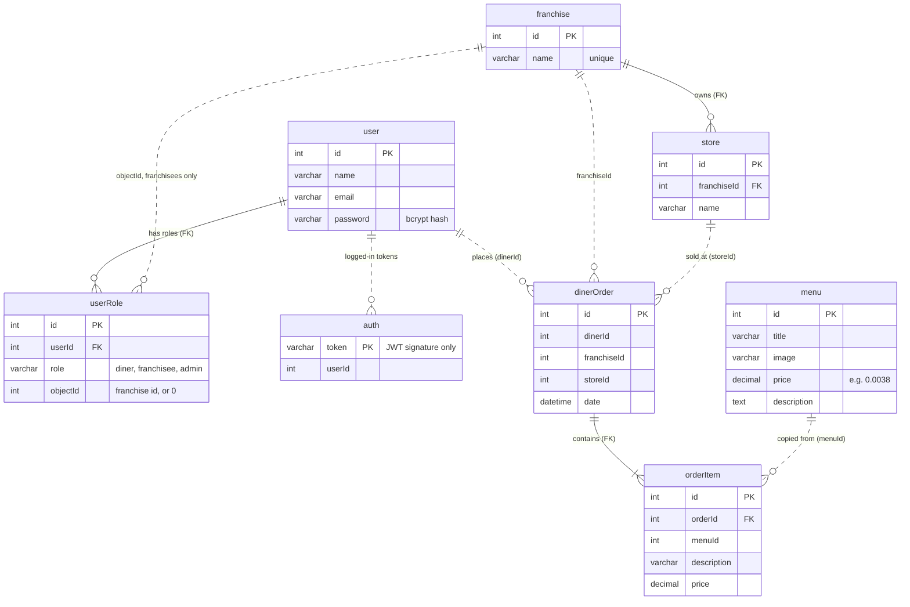
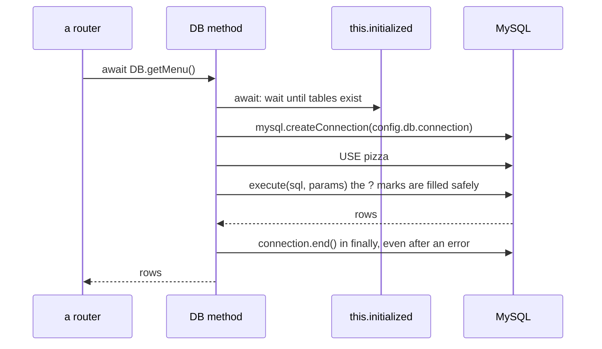
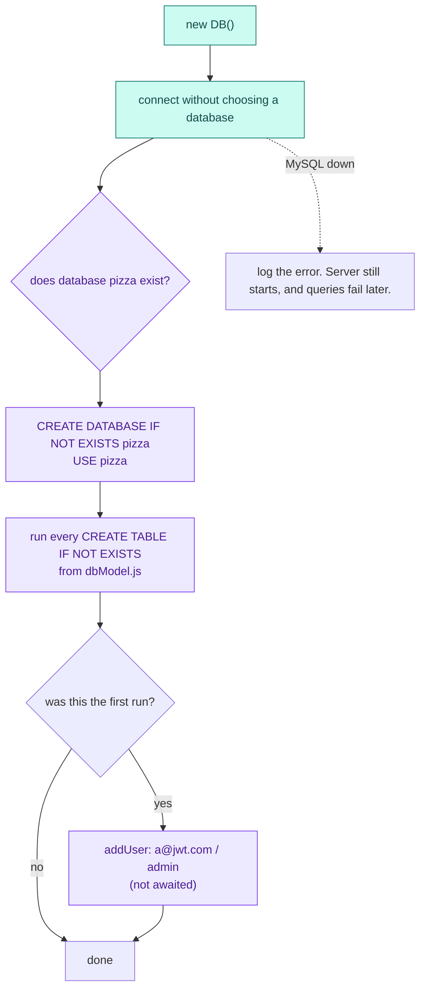

# The database

MySQL, one database named `pizza`. The tables are defined in `src/database/dbModel.js`, and every query lives in
`src/database/database.js`.

## Tables and how they connect

Solid lines are real foreign keys (MySQL enforces them). Dashed lines are links the code relies on but the database
doesn't check.

## The two columns that surprise people

**`userRole.objectId` means different things depending on `role`.** A franchisee row stores *which franchise*
they run. Diner and admin rows store `0`, because those roles don't belong to anything.

| userId | role | objectId | Meaning |
| --- | --- | --- | --- |
| 1 | admin | 0 | user 1 is an admin |
| 3 | diner | 0 | user 3 is a diner |
| 3 | franchisee | 2 | user 3 also runs franchise 2 |

**`auth.token` holds only the third part of the JWT.** A JWT looks like `header.payload.signature`.
`getTokenSignature` stores just the signature: it is unique to that token and much shorter. A row existing means
"this token is still logged in"; logout deletes the row.

**`orderItem` copies `description` and `price`** rather than only pointing at the menu, so an old order keeps the
price it was sold at even if the menu changes later.

## Which code touches which table

R = reads, W = writes (INSERT/UPDATE/DELETE).

| `DB` method | Called by | user | userRole | auth | franchise | store | menu | dinerOrder | orderItem |
| --- | --- | --- | --- | --- | --- | --- | --- | --- | --- |
| `addUser` | register, `init.js`, first startup | W | W | | R* | | | | |
| `getUser` | login | R | R | | | | | | |
| `updateUser` | PUT /api/user/:id | W, R | R | | | | | | |
| `loginUser` | register, login, update user | | | W | | | | | |
| `isLoggedIn` | `setAuthUser`, every request with a token | | | R | | | | | |
| `logoutUser` | logout | | | W | | | | | |
| `getMenu` / `addMenuItem` | menu endpoints | | | | | | R / W | | |
| `addDinerOrder` | POST /api/order | | | | | | R | W | W |
| `getOrders` | GET /api/order | | | | | | | R | R |
| `getFranchises` | GET /api/franchise | R† | R† | | R | R | | R† | R† |
| `getUserFranchises` | GET /api/franchise/:userId | R | R | | R | R | | R | R |
| `getFranchise` | the two above, store routes | R | R | | | R | | R | R |
| `createFranchise` | POST /api/franchise | R | W | | W | | | | |
| `deleteFranchise` | DELETE /api/franchise/:id | | W | | W | W | | | |
| `createStore` / `deleteStore` | store routes | | | | | W | | | |

\* only when adding a franchisee role · † only when the caller is an admin (through `getFranchise`)

## How one query runs

There is no connection pool: every method opens its own connection and closes it.

## What happens at startup

`database.js` creates its single `DB` object the first time any file `require`s it, and the constructor starts
`initializeDatabase()`:

Because the default admin is added without `await`, a script that logs in immediately after a fresh start can fail.
That's why `scripts/generatePizzaData.sh` retries until the admin exists.

## Where values are pasted into SQL

`?` placeholders keep input from changing a query. These spots build SQL with `${...}` instead, so they're worth
knowing about for security testing:

| Method | What's pasted in | Where it comes from |
| --- | --- | --- |
| `updateUser` | name, email, password hash, userId | the request body. **Injectable.** |
| `getFranchises` | `limit + 1`, `offset` | the URL query string |
| `getOrders` | `offset`, `listPerPage` | the page number in the URL, and config |
| `getUserFranchises` | franchise ids | the database's own values |
| `getID` | table and column names | fixed strings in the code |
